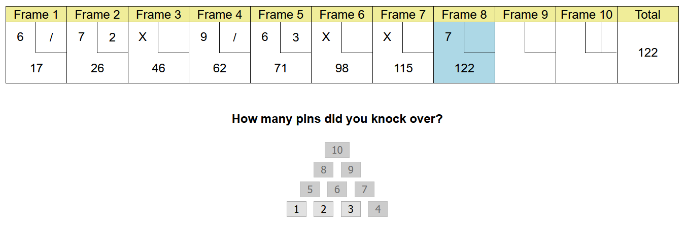
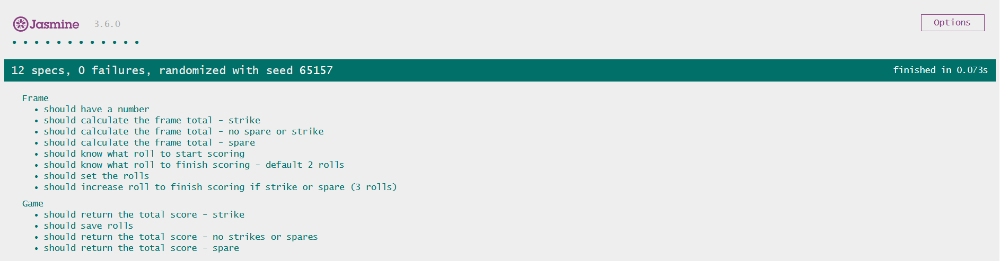

# Bowling Score-card



## About
This is a javascript bowling score card which allows users to track a game of ten-pin bowling. The score card allows users to enter the number of pins they knock over each roll and provides a running total of the score as the game progresses.

This challenge was to test my logic skills and was one of my first times using javascript.

## User Guide
To run the program clone this repo locally
```
git clone https://github.com/peter-james-allen/bowling-challenge-javascript
```

Then in the root folder open the file
```
.\public\index.html
```

The score-card will open in your browser and your ready to go. Select the number of pins knocked over. If ou need to restart refresh the page.

##Testing
Testing is done in jasmine. To run the tests in the root folder open the file
```
.\SpecRunner.html
```

All tests
